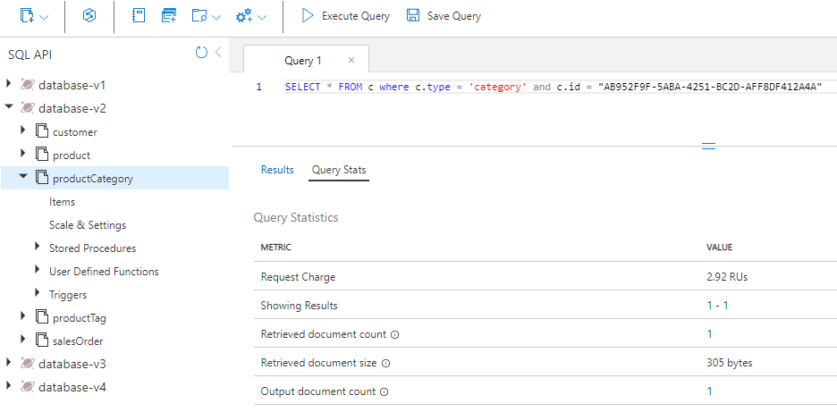
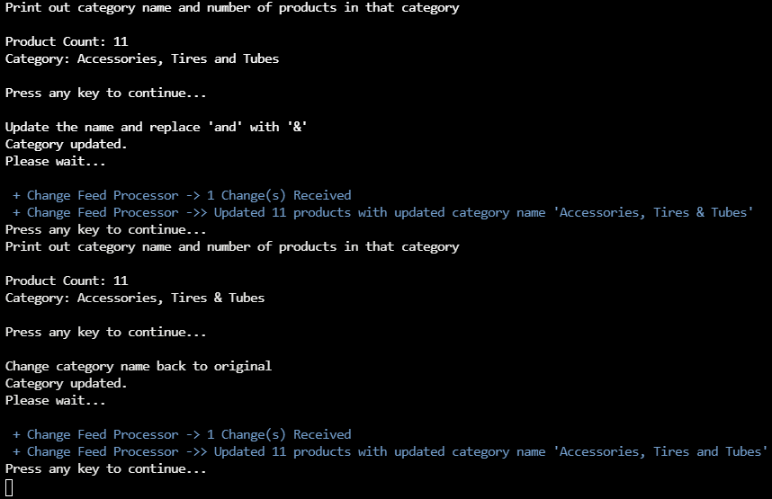

---
lab:
  title: Custo de desnormalização de dados e agregações e uso do feed de alterações para integridade referencial
  module: Module 8 - Implement a data modeling and partitioning strategy for Azure Cosmos DB for NoSQL
---

# Custo de desnormalização de dados e agregações e uso do feed de alterações para integridade referencial

O uso do modelo relacional pode nos permitir colocar entidades diferentes em seus próprios contêineres.  No entanto, em bancos de dados NoSQL, não há *junções* entre contêineres, portanto, precisamos começar a desnormalizar nossos dados para eliminar o uso de *junções*. Além disso, o NoSQL reduz o número de solicitações ao modelar os dados para que os aplicativos possam buscar seus dados com o menor número possível de solicitações. Um problema que surge ao desnormalizar nossos dados pode ser a integridade referencial entre nossas entidades; para isso, é possível usar o feed de alterações para manter os dados sincronizados. A desnormalização de agregações, como o agrupamento por contagens, também pode nos ajudar a reduzir as solicitações.  

Nesse laboratório, você verá os benefícios de como a desnormalização de dados e agregações pode nos ajudar a reduzir custos e como podemos usar o feed de alterações para manter a integridade referencial nos dados desnormalizados.

## Preparar seu ambiente de desenvolvimento

Se você ainda não clonou o repositório de código do laboratório do **DP-420** para o ambiente no qual está trabalhando nesse laboratório, siga essas etapas para fazê-lo. Caso contrário, abra a pasta clonada anteriormente no **Visual Studio Code**.

1. Inicie o **Visual Studio Code**.

    > &#128221; Se você ainda não se familiarizou com a interface do Visual Studio Code, confira o [Guia de introdução ao Visual Studio Code][code.visualstudio.com/docs/getstarted]

1. Abra a paleta de comandos e execute **Git: Clone** para clonar o repositório ``https://github.com/microsoftlearning/dp-420-cosmos-db-dev`` do GitHub em uma pasta local de sua escolha.

    > &#128161; Você pode usar o atalho de teclado **CTRL+SHIFT+P** para abrir a paleta de comandos.

1. Depois que o repositório tiver sido clonado, abra a pasta local selecionada no **Visual Studio Code**.

1. No **Visual Studio Code**, no painel **Explorer**, navegue até a pasta **17-denormalize**.

1. Abra o menu de contexto da pasta **17-denormalize** e selecione **Abrir no Terminal Integrado** para abrir uma nova instância do terminal.

1. Se o terminal for aberto como um terminal do **Windows Powershell**, abra um novo terminal do **Git Bash**.

    > &#128161; Para abrir um terminal do **Git Bash**, no lado direito do menu do terminal, clique no menu suspenso ao lado do sinal **+** e escolha *Git Bash*.

1. No **terminal do Git Bash**, execute os comandos a seguir. Os comandos abrem uma janela do navegador para se conectar ao portal do azure, onde você usará as credenciais de laboratório fornecidas.

    ```
    "C:\Program Files (x86)\Microsoft SDKs\Azure\CLI2\python.exe" -m pip install pip-system-certs
    az login
    dotnet add package Microsoft.Azure.Cosmos --version 3.49.0
    ```

    > &#128161; Se você executou o laboratório de **Desempenho da medida para entidades de cliente** primeiro e não removeu os recursos do Azure criados por esse laboratório, feche o terminal integrado, ignore a etapa a seguir e vá para a próxima seção. Observe que, se você já tiver os recursos criados pelo laboratório de **Desempenho da medida para entidades de cliente** e tentar executar o script abaixo, o script falhará.

    > &#128221; Se você estiver usando a Camada Gratuita do Cosmos DB para este laboratório, precisará atualizar o arquivo ***azuredeploy.json*** e alterar a taxa de transferência de 4000 para 1000 para todos os bancos de dados e contêineres.

1. No **terminal do Git Bash**, execute os comandos a seguir. Os comandos executam um script que cria uma nova conta do Azure Cosmos DB e, em seguida, criam e iniciam o aplicativo que você usa para preencher o banco de dados e concluir os exercícios. *Depois de inserir a credencial fornecida para a conta do Azure, o build poderá levar de 15 a 20 minutos para ser concluído, portanto, talvez seja uma boa hora para tomar um café ou chá*.

    ```
    bash init.sh
    dotnet build
    dotnet run --load-data
    echo "Data Load completed."

    ```

1. Feche o terminal integrado.

## Exercício 1: Avaliar o desempenho e os custos ao desnormalizar os dados

### Consultar o nome da categoria do produto

No **database-v2**, em que os dados são armazenados em contêineres individuais, execute uma consulta para obter o nome da categoria do produto e exibir o preço da solicitação dessa consulta.

1. Em uma nova janela ou guia do navegador da Web, navegue até o portal do Azure (``portal.azure.com``).

1. Entre no portal usando as credenciais Microsoft associadas à sua assinatura.

1. No painel esquerdo, selecione **Azure Cosmos DB**.
1. Selecione a conta do Azure Cosmos DB com o nome que começa com **cosmicworks**.
1. No painel esquerdo, selecione **Data Explorer**.
1. Expanda **database-v2**.
1. Selecione o contêiner **productCategory**.
1. Na parte superior da página, selecione **Nova consulta SQL**.
1. No painel **Consulta 1**, cole o código SQL a seguir e selecione **Executar Consulta**.

    ```
    SELECT * FROM c where c.type = 'category' and c.id = "AB952F9F-5ABA-4251-BC2D-AFF8DF412A4A"
    ```

1. Selecione a guia **Resultados** para revisar os resultados. Você verá que essa consulta retorna o nome da categoria do produto, “Componentes, Headsets”.

    

1. Selecione a guia **Estatísticas de Consulta** e anote o preço da solicitação de 2,92 RUs (unidades de solicitação).

    

### Consultar os produtos da categoria

Em seguida, consulte o contêiner de produtos para obter todos os produtos da categoria “Componentes, Headsets”.

1. Selecione o contêiner do **produto**.
1. Na parte superior da página, selecione **Nova consulta SQL**.
1. No painel **Consulta 2**, cole o código SQL a seguir e selecione **Executar Consulta**.

    ```
    SELECT * FROM c where c.categoryId = "AB952F9F-5ABA-4251-BC2D-AFF8DF412A4A"
    ```

1. Selecione a guia **Resultados** para revisar os resultados. Você vê que há três produtos retornados, Headset de HL, Headset de LL e Headset de ML. Cada produto tem SKU, nome, preço e matriz de marcas de produto.

1. Selecione a guia **Estatísticas de Consulta** e anote o preço da solicitação de 2,89 RUs.

    

   > **Observação**: você pode observar uma cobrança de solicitação um pouco diferente da relatada neste exercício, dentro de uma faixa de +/- 0,1.

### Consultar as marcas de cada produto

Em seguida, consulte o contêiner productTag três vezes, uma para cada um dos três produtos: Headset de HL, Headset de LL e Headset de ML.

#### Marcas de Headset de HL

Primeiro, execute uma consulta para retornar as marcas para Headset de HL.

1. Selecione o contêiner **productTag**.
1. Na parte superior da página, selecione **Nova consulta SQL**.
1. No painel **Consulta 3**, cole o código SQL a seguir e selecione **Executar Consulta**.

    ```
    SELECT * FROM c where c.type = 'tag' and c.id IN ('87BC6842-2CCA-4CD3-994C-33AB101455F4', 'F07885AF-BD6C-4B71-88B1-F04295992176')
    ```

    Essa consulta retorna as duas marcas do produto Headset de HL.

1. Selecione a guia **Estatísticas de Consulta** e anote o preço da solicitação de 3,06 RUs.

    

#### Marcas de Headset de LL

Em seguida, execute uma consulta para retornar as marcas para Headset de LL.

1. Selecione o contêiner **productTag**.
1. Na parte superior da página, selecione **Nova consulta SQL**.
1. No painel **Consulta 4**, cole o código SQL a seguir e selecione **Executar Consulta**.

    ```
    SELECT * FROM c where c.type = 'tag' and c.id IN ('18AC309F-F81C-4234-A752-5DDD2BEAEE83', '1B387A00-57D3-4444-8331-18A90725E98B', 'C6AB3E24-BA48-40F0-A260-CB04EB03D5B0', 'DAC25651-3DD3-4483-8FD1-581DC41EF34B', 'E6D5275B-8C42-47AE-BDEC-FC708DB3E0AC')
    ```

    Essa consulta retorna as cinco marcas para o produto Headset LL.

1. Selecione a guia **Estatísticas de Consulta** e anote o preço da solicitação de 3,47 RUs.

    

#### Marcas de headset de ML

Por fim, execute uma consulta para retornar as marcas para Headset de ML.

1. Selecione o contêiner **productTag**.
1. Na parte superior da página, selecione **Nova consulta SQL**.
1. No painel **Consulta 5**, cole o código SQL a seguir e selecione **Executar Consulta**.

    ```
    SELECT * FROM c where c.type = 'tag' and c.id IN ('A34D34F7-3286-4FA4-B4B0-5E61CCEEE197', 'BA4D7ABD-2E82-4DC2-ACF2-5D3B0DEAE1C1', 'D69B1B6C-4963-4E85-8FA5-6A3E1CD1C83B')
    ```

    Essa consulta retorna as três marcas do produto Headset de ML.

1. Selecione a guia **Estatísticas de Consulta** e anote o preço da solicitação de 3,2 RUs.

    

### Somar os encargos de RU

Agora, vamos somar todos os custos de RU de cada uma das consultas executadas.

|**Consulta**|**Custo de RU/s**|
|---------|---------|
|Nome da categoria|2.92|
|Product|2.89|
|Marcas de produto de HL|3,06|
|Marcas de produto de LL|3.47|
|Marcas de produto de ML|3,20|
|**Custo total de RU**|**15,54**|

### Executar as mesmas consultas para o seu design NoSQL

Vamos consultar as mesmas informações, mas no banco de dados desnormalizado.

1. Em Data Explorer, selecione **database-v3**.
1. Selecione o contêiner do **produto**.
1. Na parte superior da página, selecione **Nova consulta SQL**.
1. No painel **Consulta 6**, cole o código SQL a seguir e selecione **Executar Consulta**.

    ```
   SELECT * FROM c where c.categoryId = "AB952F9F-5ABA-4251-BC2D-AFF8DF412A4A"
   ```

    Os resultados devem se parecer com o exemplo a seguir:

    

1. Examine os dados que foram retornados nesta consulta. Ele contém todas as informações necessárias para renderizar os produtos para essa categoria, incluindo o nome da categoria e os nomes de marca para cada um dos três produtos.

1. Selecione a guia **Estatísticas de Consulta** e anote o preço da solicitação de 2,89 RUs.

### Comparar o desempenho dos dois modelos

No modelo relacional, em que os dados são armazenados em contêineres individuais, você executou cinco consultas para obter o nome da categoria, todos os produtos dessa categoria e todas as marcas de produto de cada um dos produtos. O preço da solicitação para as cinco consultas totalizou 15,56 RUs.

Para obter as mesmas informações no modelo NoSQL, você executou uma consulta e o preço da solicitação foi de 2,9 RUs.

O benefício não é apenas o menor custo de um design NoSQL como este modelo. Esse tipo de design também é mais rápido porque requer apenas uma solicitação. Além disso, os dados em si são servidos na forma em que provavelmente serão renderizados em uma página da Web. Isso significa menos código para gravar e manter downstream no seu aplicativo de comércio eletrônico.

Ao desnormalizar dados, você produz consultas mais simples e eficientes para seu aplicativo de comércio eletrônico. Você pode armazenar todos os dados necessários para seu aplicativo em um único contêiner e buscá-los com uma única consulta. Ao tratar de consultas de alta simultaneidade, esse tipo de modelagem de dados pode fornecer enormes benefícios em termos de simplicidade, velocidade e custo.

---

## Exercício 2: Usar o feed de alterações para gerenciar a integridade referencial

Nesta unidade, você verá como o feed de alterações pode ajudar a manter a integridade referencial entre dois contêineres no Azure Cosmos DB. Nesse cenário, você usa o feed de alterações para escutar o contêiner productCategory. Quando você atualiza o nome de uma categoria de produto, o feed de alterações captura o nome atualizado e define todos os produtos dessa categoria com o novo nome.

Neste exercício, você vai concluir as seguintes etapas:

- Conclua um código C# para realçar os principais conceitos a entender.
- Inicie o processador do feed de alterações para que ele comece a escutar o contêiner productCategory.
- Consulte o contêiner de produtos da categoria cujo nome você está alterando e o número dos produtos nessa categoria.
- Atualize o nome da categoria e observe enquanto o feed de alterações propaga essas alterações no contêiner de produtos.
- Consulte o novo contêiner de produtos com o novo nome de categoria e conte o número de produtos para verificar se todos eles foram atualizados.
- Altere o nome de volta para o original e observe enquanto o feed de alterações propaga as alterações de volta.

### Iniciar o Azure Cloud Shell e abrir o Visual Studio Code

Para ir até o código que você vai atualizar no feed de alterações, faça o seguinte:

1. Se ainda não estiver aberto, abra o Visual Studio Code e abra o arquivo *Program.cs* na pasta *17-denormalize*.

### Concluir o código para o feed de alterações

Adicione código para gerenciar as alterações que são passadas no delegado, execute um loop para cada um dos produtos dessa categoria e atualize-os.

1. Navegue até a função que inicia o processador do feed de alterações.

1. Selecione Ctrl+G e digite **603** para ir até essa linha no arquivo.

1. Agora, você deverá ver o código a seguir:

    

   Nas linhas 588 e 589 há duas referências de contêiner. Precisamos atualizá-los com os nomes de contêiner corretos. O feed de alterações funciona criando uma instância do processador do feed de alterações na referência do contêiner. Nesse caso, você está observando as alterações no contêiner productCategory.

1. Na linha 588, substitua **{container to watch}** por `productCategory`.

1. Na linha 589, substitua **{container to update}** por `product`. Quando o nome de uma categoria de produto é atualizado, cada produto dessa categoria precisa ser atualizado com o novo nome de categoria atribuído.

1. Embaixo das linhas *container to watch* e *container to update* revise e linha *leaseContainer*. O leaseContainer funciona como um ponto de verificação no contêiner. Ele sabe o que foi atualizado desde a última vez que foi verificado pelo processador do feed de alterações.
  
   Quando o feed de alterações vê uma nova alteração, ele chama um delegado e passa as alterações em uma coleção somente leitura.

1. Na linha 603, você precisa adicionar um código que será chamado quando o feed de alterações tiver uma nova alteração que precise ser processada. Para fazer isso, copie o seguinte trecho de código e cole-o abaixo da linha que começa com **//To-Do**:

    ```
    //Fetch each change to productCategory container
    foreach (ProductCategory item in input)
    {
        string categoryId = item.id;
        string categoryName = item.name;
    
        tasks.Add(UpdateProductCategoryName(productContainer, categoryId, categoryName));
    }
    ```

1. Seu código deve ser parecido com o código na imagem a seguir:

    

    Por padrão, o feed de alterações é executado a cada segundo. Em cenários nos quais há muitas inserções ou atualizações feitas no contêiner observado, o delegado poderá ter mais de uma alteração. Por esse motivo, digite a **entrada** do delegado como **IReadOnlyCollection**.

    Esse trecho de código percorre todas as alterações na **entrada** do delegado e as salva como cadeias de caracteres para **categoryId** e **categoryName**. Em seguida, ele adiciona uma tarefa à lista de tarefas com uma chamada a outra função que atualiza o contêiner de produtos com o novo nome de categoria.

1. Selecione Ctrl+G e digite **647** para localizar a função **UpdateProductCategoryName()**. Aqui, você escreve um código que atualiza cada produto do contêiner de produtos com o novo nome de categoria capturado pelo feed de alterações.

1. Copie o seguinte snippet de código e cole-o abaixo da linha que começa com **//To-Do:**. A função faz duas coisas. Primeiro, ela consulta o contêiner do produto para todos os produtos da **categoryId** passada. Em seguida, atualiza cada produto com o novo nome de categoria atribuído.

    ```
    //Loop through all products
    foreach (Product product in response)
    {
        productCount++;
        //update category name for product
        product.categoryName = categoryName;
    
        //write the update back to product container
        await productContainer.ReplaceItemAsync(
            partitionKey: new PartitionKey(categoryId),
            id: product.id,
            item: product);
    }
    ```

    Agora, o código deverá ter a aparência a seguir.

    

    O código lê as linhas do objeto de resposta da consulta e atualiza o contêiner de produtos com todos os produtos retornados pela consulta.

    Você está usando um loop **foreach()** para percorrer cada produto retornado pela consulta. Para cada linha, você atualiza um contador para saber quantos produtos foram atualizados. Em seguida, atualize o nome da categoria do produto para o novo **categoryName**. Por fim, chame **ReplaceItemAsync()** para atualizar o produto novamente no contêiner de produtos.

1. Pressione Ctrl+S para salvar suas alterações.

1. Se ele ainda não estiver aberto, abra um Terminal Integrado do Git Bash e verifique se você está na pasta *17-desnormalize*.

1. Para compilar e executar o projeto, execute o comando a seguir:

    ```
    dotnet build
    dotnet run
    ```

1. Sua tela agora deve exibir o menu principal do aplicativo.

    

### Executar o exemplo do feed de alterações

Agora que você concluiu o código do feed de alterações, vamos vê-lo em ação.

1. No menu principal, selecione **a** para iniciar o processador do feed de alterações. Sua tela exibirá o progresso.

    

1. Pressione qualquer tecla para retornar ao menu principal.

1. Selecione **b** no menu principal para atualizar o nome da categoria de produto. A sequência a seguir ocorre:

    a. Consulta o contêiner de produtos para a categoria “Acessórios, Pneus e Tubos” e conta quantos produtos existem nessa categoria.  
    b. Atualiza o nome de categoria e substitui a palavra “e” por um “e” comercial (&).  
    c. O feed de alterações recebe essa alteração e, usando o código que você escreveu, atualiza todos os produtos dessa categoria.  
    d. O feed de alterações reverte a alteração de nome e altera o nome da categoria de volta, substituindo o “&” pelo “e”.  
    e. O feed de alterações pega essa alteração e atualiza todos os produtos de volta para o nome da categoria de produto original.

1. Selecione **b** no menu principal e siga os prompts até que o feed de alterações seja executado uma segunda vez e mantenha-o pressionado. Os resultados serão semelhantes a este:

    

1. Se você clicou muito e retornou ao menu principal, selecione **b** novamente para observar as alterações.

1. Quando terminar, digite **x** para sair e retornar ao Cloud Shell.

---

## Exercício 3: Desnormalização de agregações

Nesta unidade, você verá como desnormalizar uma agregação para gravar as 10 principais consultas dos clientes em seu site de comércio eletrônico. Você usará o recurso de lote transacional no SDK .NET do Azure Cosmos DB que insere simultaneamente um novo pedido de vendas e atualiza a propriedade **salesOrderCount** do cliente, ambos na mesma partição lógica.

Neste exercício, você vai concluir as seguintes etapas:

- Exibir o código para criar um pedido de venda.
- Concluir o código C# para incrementar a *salesOrderCount* em uma unidade para o cliente em questão.
- Concluir o código C# para implementar a transação para inserir o novo pedido de venda e atualizar o registro do cliente usando o *lote transacional*.
- Executar uma consulta para um cliente específico a fim de ver o registro do cliente e todos os seus pedidos.
- Criar um pedido de venda para esse cliente e atualizar a propriedade **salesOrderCount**.
- Executar sua consulta dos 10 principais clientes para ver quais são os resultados atuais.
- Mostrar como você pode usar o lote transacional quando um cliente cancela um pedido.

## Abra o Visual Studio Code

Para obter o código que você usará nesta unidade, siga estas etapas:

1. Se ainda não estiver aberto, abra o Visual Studio Code e abra o arquivo *Program.cs* na pasta *17-denormalize*.

## Concluir o código para atualizar os pedidos de vendas totais

1. Vá para a função que cria um pedido de venda.

1. Selecione Ctrl+G e, em seguida, digite **483** para ir até essa linha no arquivo.

1. Agora, você deverá ver o código a seguir:

    

    Essa função cria um pedido de venda e atualiza o registro de cliente usando o lote transacional.

    Primeiro, o registro do cliente é recuperado chamando **ReadItemAsync()** e passando a **customerId** como chave de partição e ID.

1. Na linha 483, abaixo do comentário **//To-Do:**, aumente o valor de **salesOrderCount** colando o seguinte trecho de código:

    ```
    //Increment the salesOrderTotal property
    customer.salesOrderCount++;
    ```

    Sua tela agora deve ser semelhante a esta:

    

## Concluir o código para implementar o lote transacional

1. Role para baixo algumas linhas para ver os dados do pedido de vendas que você criará para seu cliente.

    Seu novo objeto de pedido de vendas tem um cabeçalho e uma estrutura de detalhes típica de pedidos de vendas em um aplicativo de comércio eletrônico.

    O cabeçalho do pedido de vendas tem **orderId**, **customerId**, **orderDate** e **shipDate**, que você deixará em branco.

    Como seu contêiner de cliente contém entidades de cliente e de pedido de vendas, o objeto do pedido de vendas também contém a propriedade discriminatória, **type**, com o valor de **salesOrder**. Isso ajuda a distinguir uma ordem de venda de um objeto de cliente no seu contêiner de cliente.

    Mais abaixo, você também pode ver os dois produtos para o pedido que compõe a seção de detalhes em seu pedido de venda.

1. Role um pouco mais até o outro comentário **//To-Do:**. Aqui, você precisará adicionar um código que insere um novo pedido de venda e atualiza o registro de cliente usando o lote transacional.

1. Copie o seguinte trecho de código e cole-o na linha abaixo do comentário **//To-Do:**.

    ```
    TransactionalBatchResponse txBatchResponse = await container.CreateTransactionalBatch(
        new PartitionKey(salesOrder.customerId))
        .CreateItem<SalesOrder>(salesOrder)
        .ReplaceItem<CustomerV4>(customer.id, customer)
        .ExecuteAsync();
    if (txBatchResponse.IsSuccessStatusCode)
        Console.WriteLine("Order created successfully");
    ```

    Esse código chama **CreateTransactionalBatch()** em seu objeto de contêiner. Ele assume o valor da chave de partição como um parâmetro necessário, porque todas as transações têm o escopo definido como apenas uma partição lógica. Você também passará seu novo pedido de vendas chamando **CreateItem()** e seu objeto de cliente atualizado chamando **ReplaceItem()**. Em seguida, chame **ExecuteAsync()** para executar a transação.

    Por fim, verifique se a transação foi bem-sucedida observando o objeto de resposta.

    Sua tela agora deverá ser semelhante à imagem a seguir:

    

1. Pressione Ctrl+S para salvar suas alterações.

1. Se ele ainda não estiver aberto, abra um Terminal Integrado do Git Bash e verifique se você está na pasta *17-desnormalize*.

1. Para compilar e executar o projeto, execute o comando a seguir:

    ```
    dotnet build
    dotnet run
    ```

1. Sua tela agora deverá exibir o menu principal do aplicativo, conforme mostrado aqui:

    

## Consultar o cliente e seus pedidos de vendas

Como você projetou o banco de dados para armazenar o cliente e todos os seus pedidos de vendas no mesmo contêiner usando **customerId** como chave de partição, é possível consultar o contêiner do cliente e retornar o registro do cliente e todos os seus pedidos de vendas em uma única operação.

1. No menu principal, selecione **c** para executar o item de menu **Consultar cliente e todos os pedidos dele**. Essa consulta retorna o registro do cliente, seguido por todos os pedidos de vendas dele. Você deverá ver todas as saídas de pedidos de vendas do cliente listadas na tela.

   Observe que o último pedido foi para **Road-650 Red, 58** por US$ 782,99.

1. Role a tela para cima até **Imprimir o registro do cliente e todos os pedidos dele**.

   Observe que a propriedade **salesOrderCount** mostra dois pedidos de vendas.

   Sua tela deverá parecer com o seguinte:

    

## Criar um pedido de venda e atualizar o total de pedidos de vendas da transação

Crie um pedido de vendas para o mesmo cliente e atualize o total de pedidos de vendas salvos no registro do cliente.

1. Pressione qualquer tecla na janela para retornar ao menu principal.
1. Selecione **d** para executar o item de menu **Criar pedido e atualizar o total do pedido**.
1. Pressione qualquer tecla para retornar ao menu principal.
1. Selecione **c** para executar a mesma consulta novamente.

   Observe que o novo pedido de venda mostra **Quadro Montanha HL – Preto, 38** e **Meias de corrida, M**.

1. Role de volta para cima até **Imprimir o registro do cliente e todos os pedidos dele**.

   Observe que a propriedade **salesOrderCount** mostra três pedidos de vendas.

1. Sua tela deverá parecer com o seguinte:

    

## Excluir um pedido usando o lote transacional

Como em qualquer aplicativo de comércio eletrônico, os clientes também cancelam pedidos. Você também pode fazer o mesmo aqui.

1. Pressione qualquer tecla para retornar ao menu principal.

1. Selecione **f** para executar o item de menu para **Excluir pedido e atualizar total do pedido**.

1. Pressione qualquer tecla para retornar ao menu principal.
1. Selecione **c** para executar a mesma consulta novamente a fim de confirmar se o registro do cliente foi atualizado.

   Observe que o novo pedido não é mais retornado. Se você rolar para cima, verá que o valor de **salesOrderCount** voltou a ser **2**.

1. Pressione qualquer tecla para retornar ao menu principal.

## Exibir o código que exclui um pedido de vendas

Você exclui uma ordem de venda exatamente da mesma maneira que cria uma. Ambas as operações são envolvidas em uma transação e executadas na mesma partição lógica. Vamos examinar o código que faz isso.

1. Digite **x** para sair do aplicativo.
1. Se ainda não estiver aberto, abra o Visual Studio Code e abra o arquivo *Program.cs* na pasta *17-denormalize*.

1. Selecione Ctrl+G e, em seguida, insira **529**.

    Essa função exclui o novo pedido de vendas e atualiza o registro do cliente.

    Aqui você pode ver que o código primeiro recupera o registro do cliente e, em seguida, diminui o **salesOrderCount** em 1.

    Em seguida será a chamada para **CreateTransactionalBatch()**. Novamente, o valor da chave de partição lógica é passado, mas, dessa vez, **DeleteItem()** é chamado com a ID do pedido e **ReplaceItem()** é chamado com o registro do cliente atualizado.

## Exibir o código da consulta dos seus 10 principais clientes

Vamos examinar a consulta dos seus 10 principais clientes.

1. Selecione Ctrl+G e, em seguida, insira **566**.

    Perto da parte superior está a definição da sua consulta.

    ```
    SELECT TOP 10 c.firstName, c.lastName, c.salesOrderCount
        FROM c WHERE c.type = 'customer'
        ORDER BY c.salesOrderCount DESC
    ```

    Essa consulta é bastante simples, com uma instrução **TOP** para limitar o número de registros retornados e um **ORDER BY** na propriedade **salesOrderCount** em ordem decrescente.

    Observe também a propriedade discriminatória de **tipo** com um valor de **cliente**, para que você retorne apenas os clientes porque o contêiner de clientes tem clientes e pedidos de vendas dentro dele.

1. Para iniciar o aplicativo novamente se ele ainda não estiver em execução, execute o seguinte comando:

    ```
    dotnet run
    ```

1. Por fim, digite **e** para executar a consulta.

    

    Algo que talvez você não perceba é que a consulta dos 10 principais clientes é uma consulta entre partições distintas, que traz saídas em todas as partições do seu contêiner.

    O laboratório de adoção deste exemplo mostrou que você deve se esforçar para evitar consultas entre partições distintas. No entanto, na realidade, essas consultas podem ser úteis em situações em que o contêiner ainda é pequeno ou se a consulta é executada com pouca frequência. Se essa consulta for executada com frequência ou se o contêiner for excepcionalmente grande, valerá a pena explorar o custo de materializar esses dados em outro contêiner e usá-los para atender a essa consulta.

## Limpar

Exclua o Grupo de Recursos criado neste laboratório.  Se você não tiver acesso para remover o Grupo de Recursos, remova todos os objetos do Azure criados por este laboratório.

[code.visualstudio.com/docs/getstarted]: https://code.visualstudio.com/docs/getstarted/tips-and-tricks
